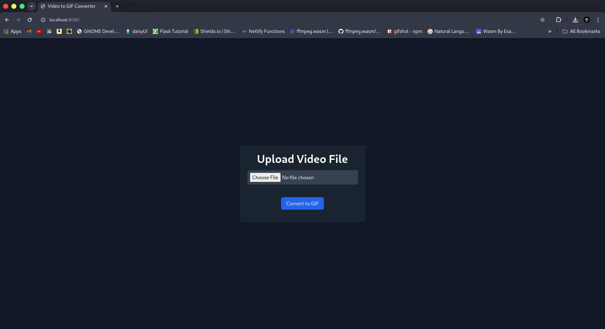

# GIFNETOR

A gif creation appliction that takes input as a video files like mp4, mov, mvk and converts it into a gif image.

"How is it possiable ?", you ask.

By opening the video file and reading all the frames inside the file, then convering those high level color images to low level color images (since gif uses low level images) and then writing those images into a gif file, these files are stored in uploads folder.

And there you go, you have successfully converted a video to an image/gif.

> Note : The converted image will larger then the video file. Since gif files have limited colors compared to a video.

## Requirments

1. Go
2. ffmpeg

## Output

output 1

output 2

